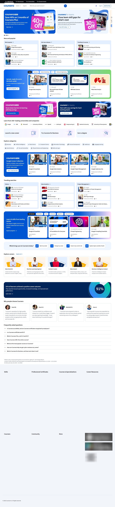
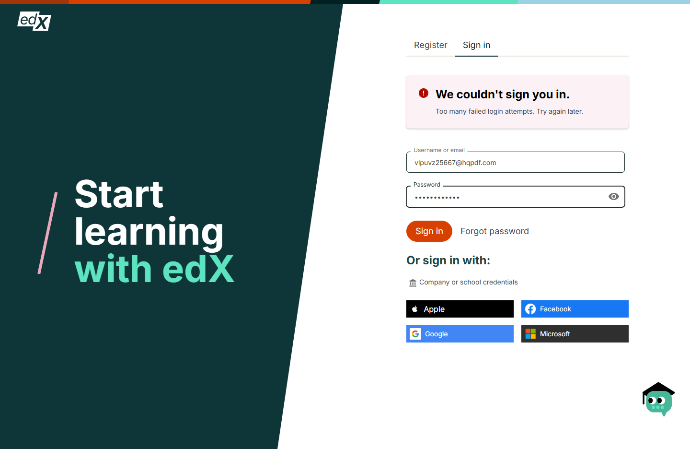
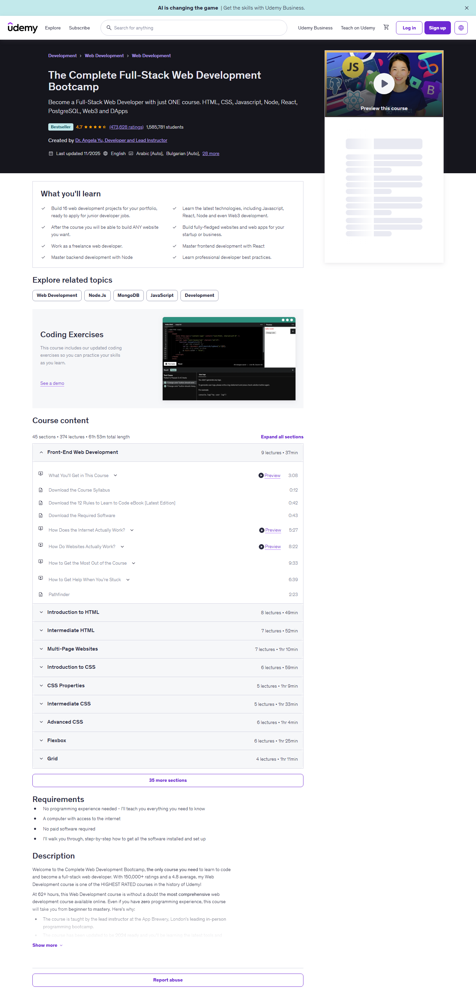
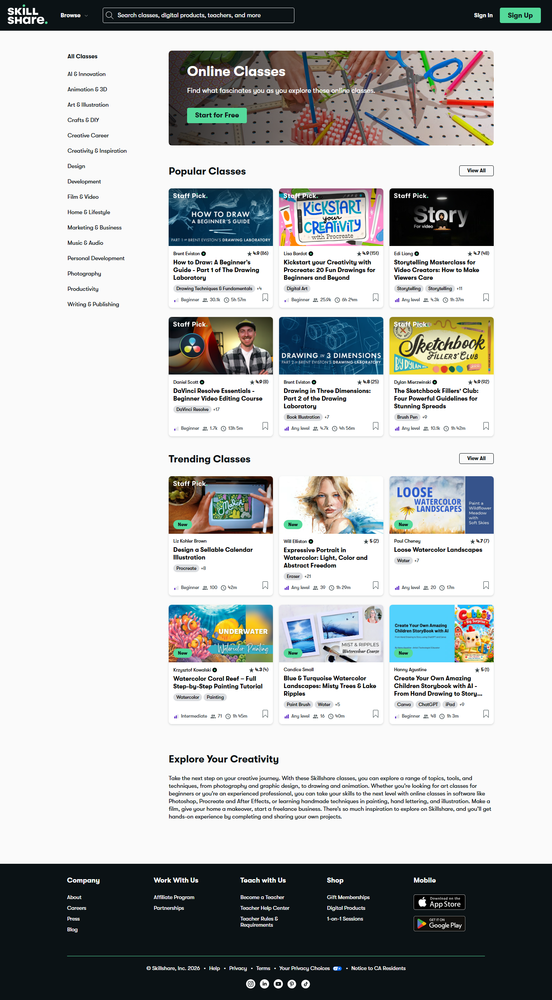
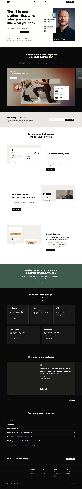

# Competitor UI/UX Analysis — Coursera, edX, Udemy, Skillshare, Kajabi

**Purpose:** ground a redesign pass on Deciding in the Dark (DITD) in what the established
learning/course platforms actually do today, not folklore about them.

**Method:** live screenshots captured 2026‑08‑20 with a real Chromium browser (Playwright),
1440×900 viewport, full‑page. Screenshots live in [`screenshots/`](screenshots/), one folder
per platform. Every image referenced below is a real capture from that session — nothing here
is a mockup.

**What could and couldn't be captured (read this before the rest):**

| Platform | Public pages | Logged‑in / after‑signup |
|---|---|---|
| Coursera | ✅ home, browse, course detail, search, Coursera Plus pricing | ❌ Blocked. The login modal's "Continue" never advanced past the email step — Coursera protects that form with reCAPTCHA Enterprise (disclosed in the modal's own footer), which silently rejects scripted submits. One attempt made, not retried. |
| edX | ✅ home, search, course detail, executive‑education programs | ⚠️ Partial. The form filled and submitted, but edX returned **"We couldn't sign you in — too many failed login attempts. Try again later"** — a lockout state that predates or resulted from this one attempt. Not retried, since retrying into a lockout screen only compounds it. Captured the login page, filled state, and this error screen. |
| Udemy | ✅ home, category, course detail | ❌ Blocked. The login page sits behind a Cloudflare "Performing security verification" interstitial (cleared after a longer wait), and the actual credential submission then returned **"Sorry, something went wrong"** — consistent with server‑side bot detection on the auth endpoint. Captured the login page and this error state; did not keep retrying against it. |
| Skillshare | ✅ home, browse, design category | Not attempted — no credentials were provided for Skillshare. |
| Kajabi | ✅ home, pricing, features, templates | N/A — Kajabi is the SaaS *creators* build on, not a course marketplace with a learner login; there's no "after signup" learner dashboard to reach the same way. |

So the "signed‑in dashboard / course player" screenshots you asked for don't exist for
Coursera/edX/Udemy — all three sit behind real anti‑automation defenses, and pushing harder
(retrying credentials, solving the challenges) isn't something this was willing to do. Every
other page below is a genuine, current capture. Where the report describes a dashboard or
course‑player layout, it's from public knowledge / help‑center documentation, and is labeled
as such rather than passed off as a screenshot.

---

## 1. Coursera

**Positioning:** university‑credentialed, career‑outcome‑driven, enterprise‑ and
degree‑oriented. Every surface repeats "Professional Certificate," accredited university
names, and completion/salary stats.



- **Nav:** persistent top bar — audience switcher (Individuals/Businesses/Universities/
  Governments), mega‑menu "Explore," a single global search, Log in / **Join for Free** (green,
  the one saturated CTA colour on the page).
- **Home:** stacked horizontal carousels ("New and popular," "Trending in AI courses"),
  each card = thumbnail + partner logo + title + level + rating. A full‑width promo band
  (Coursera Plus discount) breaks up the carousels rather than sitting only in a hero.
  A "What brings you to Coursera today?" intent‑picker (career/role chips) mid‑page routes
  by goal, not just by topic.
- **Browse** ([screenshot](screenshots/coursera/02-browse.png)): a flat category‑chip row up
  top, then the same carousel pattern repeated ~15 times down the page (by skill, by role,
  by trending, by partner). No real filter sidebar on this page — filtering happens on
  **search** instead.
- **Search** ([screenshot](screenshots/coursera/05-search-results.png)): classic left‑rail
  faceted filters (subject, level, duration, language, rating) + result cards with partner
  logo, star rating, review count, "Free trial" badges.
- **Course detail** ([screenshot](screenshots/coursera/03-course-detail.png)): university
  crest + partner logo above the title (credibility first), a stat strip (modules ⋅ rating ⋅
  level ⋅ schedule ⋅ % who liked it), sticky-feeling enroll card top‑right, tabbed sections
  (About / Outcomes / Modules / Testimonials / Reviews), instructor card with photo + course
  count + rating, a learner‑review list with star breakdown bars, and an FAQ accordion near
  the bottom. "Explore more from [topic]" carousel before the reviews.
- **Pricing** ([screenshot](screenshots/coursera/04-plus-pricing.png)): couldn't load
  (404) at the URL first tried; the real Plus page moved. Not re‑captured — low priority
  relative to the rest, and the promo banners on every other page already show the pattern
  (annual‑vs‑monthly toggle, single highlighted "Most popular" tier).
- **Auth modal** ([screenshot](screenshots/coursera/10-login-page.png)): a centered modal
  over a dimmed home page (not a separate page) — email first, password on a second step,
  social‑login buttons below, reCAPTCHA disclosure in the fine print.

**Strengths:** credibility stacking (institutional logos everywhere), goal‑based routing,
dense but organised information architecture on the course page.
**Weaknesses:** extremely promo‑heavy (discount banners on nearly every screenshot), busy —
browse is 15+ stacked carousels with little breathing room, mega information density can feel
like a catalog rather than a curated product.

---

## 2. edX

**Positioning:** similar credential focus to Coursera, but broader mix — free/audit courses,
professional certificates, executive education, full online degrees.



- **Auth page** is a real page, not a modal — split‑screen: brand statement + illustration on
  a dark teal panel (left), the form on white (right). Register/Sign‑in as tabs, "log in with
  organisation" as a distinct SSO path, social buttons in a 2×2 grid.
- **Error state** ([screenshot](screenshots/edx/12-after-login.png)) is a good reference in
  its own right: red icon + bold one‑line summary + a plain‑language second line, sitting
  *above* the form, with the offending field re‑outlined in red — no vague "invalid
  credentials."
- **Course detail** ([screenshot](screenshots/edx/03-course-detail.png)): university crest
  again, but a cleaner stat‑icon row (self‑paced ⋅ weeks ⋅ hours/week ⋅ certificate) directly
  under the title, a promo banner with a countdown‑flavoured discount code, an embedded
  video‑preview module ("CS50x" trailer), a **stacked‑cards upsell** ("Want a deeper learning
  experience?" → 3 related paid certificates with individual prices), then instructor cards,
  a learner‑testimonial carousel, and a plain‑text FAQ block (no accordion — just headings and
  paragraphs, notably less polished than Coursera's here).
- **Executive education hub** ([screenshot](screenshots/edx/04-programs.png)): a
  dedicated landing page for the B2B/exec audience — hero stat row (100M learners / 580K
  professionals / 6–20 week programs), then **subject‑area jump links** that scroll to
  anchored category sections below (Business, Healthcare, Tech, Leadership, …), each section a
  card grid. This "jump to a subject, land on a pre‑filtered section of the same page" pattern
  is worth stealing — it avoids a full page reload for what's really still browsing.
- **Footer:** the most complete of all five — four full columns (Skills / Certificates /
  Degrees / Resources) is closer to a sitemap than a footer, clearly doing SEO + "didn't find
  it in nav" duty at once.

**Strengths:** honest error states, the exec‑ed jump‑link pattern, video preview embedded
directly in the course page rather than gated behind a click.
**Weaknesses:** FAQ treatment is visibly less designed than the rest of the page; heavier
visual clutter from stacked promo banners than Coursera.

---

## 3. Udemy

**Positioning:** individual‑instructor marketplace, price‑and‑ratings driven, high‑frequency
sales/discount messaging ("62 hours," "150,000+ ratings," strikethrough pricing implied by the
promo banner).



- **Nav:** category mega‑menu ("Explore"), a *dominant* full‑width search bar (Udemy is
  search‑first, not browse‑first), Udemy Business upsell link sitting in the primary nav
  itself.
- **Category page** ([screenshot](screenshots/udemy/02-category.png)): a real left‑rail
  filter sidebar (rating stars as filters, video‑duration buckets, topic, level, language,
  price) + list‑style result rows (thumbnail + title + instructor + rating + review count +
  student count + price + "Bestseller" ribbon). More utilitarian / less card‑carousel than
  Coursera — this is a page built for comparison shopping.
- **Course detail** ([screenshot](screenshots/udemy/03-course-detail.png)) is the most
  conversion‑optimised of the five:
  - Dark hero band with breadcrumb, title, one‑line pitch, a **ratings+reviews+student‑count
    line directly under the title** (social proof before any description),
    instructor byline, "last updated" + language count, and a sticky‑feeling preview‑video
    card top‑right with a skeleton "buy box" beneath it (price, add‑to‑cart, wishlist — this
    is the part that stays pinned on scroll in the live product).
  - "What you'll learn" as a two‑column checklist immediately below the fold — before any
    marketing prose.
  - Topic chips ("Explore related topics") functioning as internal search links.
  - A **curriculum accordion** with section‑level lecture counts + duration, individual
    lecture rows showing icon (video/reading) + a "Preview" link on unlockable ones — you can
    scan the entire syllabus depth without buying.
  - Trust logos strip (Nasdaq, VW, NetApp, Eventbrite) using "Business" customers as social
    proof even on a B2C page.
- **Login page** ([screenshot](screenshots/udemy/10-login-page.png)): single email field +
  Continue (progressive disclosure to password), full‑bleed illustration, "Log in with your
  organization" as a secondary path — same shape as edX and Coursera; this three‑platform
  repetition (email step → password step, org‑SSO offered separately) is clearly the converged
  best practice, not a coincidence.

**Strengths:** the buy‑box + curriculum‑accordion + social‑proof‑under‑title combination on
the course page is the single most conversion‑tuned layout of the five and the one most worth
borrowing from directly.
**Weaknesses:** relentless discount/urgency messaging; the marketplace model means visual
quality varies wildly by course thumbnail (no consistent art direction across cards, unlike
Coursera's partner‑logo consistency).

---

## 4. Skillshare

**Positioning:** creative/hobbyist, subscription‑first (not per‑course purchase), community
and project‑based framing ("classes," not "courses").



- **Nav:** minimal — logo, a "Browse" category dropdown, one search bar, Sign In / **Sign Up**
  (the only saturated‑green CTA on an otherwise black‑and‑white nav). Much quieter than the
  other four.
- **Browse** ([screenshot](screenshots/skillshare/02-browse.png)): a persistent left‑rail
  category list (not filters — literal category navigation, à la a magazine's section list),
  a hero banner per category with a "Start for Free" CTA, then "Popular"/"Trending" 3‑column
  card grids. Cards are unusually rich for a listing page: teacher avatar, star rating +
  review count, level badge, student count, and **run time** all in a compact footer row.
- Selecting a subcategory (e.g. Design → UI/UX Design) filters in place via the left rail
  without a page reload — a lighter‑weight interaction than Coursera/Udemy's full navigations.
- **Footer:** organised by audience (Company / Work With Us / Teach with Us / Shop / Mobile)
  rather than by content — a reminder that Skillshare's real business is the
  subscription + "become a teacher" supply side, not one‑off purchases.

**Strengths:** the calmest, least promo‑cluttered visual design of the five; card density
that still reads as premium, not busy; a persistent category rail that also filters — two
purposes, one control.
**Weaknesses:** thinnest course‑page depth of the group (no curriculum breakdown visible from
browse — you have to click in); subscription‑only pricing model doesn't map directly to a
per‑product store.

---

## 5. Kajabi

**Positioning:** not a course marketplace — the *software* course creators/coaches build their
own branded platform on top of. Its own marketing site is the only thing to evaluate (there's
no learner storefront to browse).



- **Home:** a big four‑line value headline, then a **2×3 feature grid** (Online Courses /
  Coaching / Communities / Memberships / Newsletters / Podcasts) — each tile: one‑line pitch,
  "Learn More" link, and a row of small competitor logos it "replaces" (Thinkific, Teachable,
  Kartra, …) — a direct-comparison device baked into the marketing page itself.
- Below the fold, sections alternate white → near‑black bands (a rhythm, not random) — each
  black band houses a screenshots‑of‑the‑product mockup (a real in‑app dashboard preview,
  "Welcome back, Sydney" style) next to feature bullets, always ending in a "Start Free Trial"
  CTA repeated per‑section rather than once at the top.
- **Pricing** ([screenshot](screenshots/kajabi/02-pricing.png)): 3‑tier card row (Basic /
  Growth‑"Most Popular" / Pro), each with a short feature list and its own CTA, followed by a
  **very long full feature‑comparison matrix** grouped into labelled sections (Platform &
  Creator Tools, Sales & Monetization, Automation & Customer Management, Team & Brand,
  Payment Rates) — this is the most thorough pricing‑table pattern of the five, clearly aimed
  at a considered B2B‑ish purchase decision rather than an impulse buy.
- **FAQ:** dark band, plain accordion, 7 questions — consistent placement with every other
  platform (FAQ sits right before the final CTA/footer, always).

**Strengths:** the competitor‑logo‑replacement device on the feature grid, the alternating
light/dark section rhythm, the exhaustive pricing‑comparison matrix.
**Weaknesses:** none of this applies to a learner‑facing storefront — Kajabi is closer to
DITD's own *admin/creator* tooling than to its public catalogue.

---

## 6. Cross‑platform patterns (the parts repeated everywhere, which means they're load‑bearing)

These showed up independently across three or more of the five platforms — strong signal
they're not house style, they're what works:

1. **Auth is a two‑step, progressive‑disclosure form** — email first, "Continue," *then*
   password — with an "organization/SSO" path offered as a clearly secondary link, never
   mixed into the primary button. Coursera, edX, and Udemy all do exactly this.
2. **Social proof sits directly under the title**, before any marketing copy — star rating +
   review count + enrolled/student count, as plain text, not buried in a tab. Udemy and
   Coursera both lead with it; edX leads with a stat‑icon row instead (weeks/hours/certificate)
   but the position is identical.
3. **The buy decision gets a self‑contained card**, not a bare button — price, one‑line access
   terms, and the CTA together, usually with its own border/shadow separating it from the
   surrounding prose (Udemy's sticky buy box, Coursera's enroll card, DITD already does a
   version of this on `CourseDetail.tsx`/`PackDetail.tsx`).
4. **Curriculum is an accordion of modules**, each row showing type icon + duration +
   lock/preview state — never a flat list, never hidden behind a click‑through. DITD's
   `CourseDetail.tsx` already has the icon+lock+duration row; it's missing the collapse/expand
   and the per‑module duration subtotal.
5. **Instructor/author gets a face** — small photo, name, one credibility line (course count,
   rating, institution). None of the five ever names an author as plain text alone.
6. **FAQ accordion, positioned right before the final CTA/footer**, every single time, no
   exceptions across all five platforms.
7. **Related‑content carousel** near the bottom of a course page ("Explore more from
   Machine Learning" / "35 more sections" / trending‑nearby classes) — keeps someone who
   wasn't convinced by *this* item inside the site instead of bouncing.
8. **Filter sidebars only appear on true "many results to narrow down" pages** (search /
   category listings) — never on a curated home or landing page, which instead use carousels.
   Mixing the two (a filter rail on a page with 8 items) is a tell of an under‑designed
   catalogue.
9. **Trust logos** (university crests, company logos, "as seen in") appear on nearly every
   page type, not just the homepage — repetition, not a single hero placement, is what makes
   them register.

---

## 7. Where Deciding in the Dark stands today

This matters more than it might seem: **DITD is not starting from a generic template.**
[`theme.css`](../../frontend/src/styles/theme.css) documents an unusually deliberate, custom
visual system — an ivory/navy/champagne‑gold "private bank meets editorial publisher"
identity, a bespoke type stack (Schibsted Grotesk / Newsreader / Azeret Mono), and
contrast‑audited tokens for both themes. Every one of the five platforms above is a
generic SaaS‑blue‑and‑white template by comparison — Coursera, edX, and Udemy in particular
are close enough to indistinguishable in their base chrome. **The recommendation below is not
"make it look like Udemy."** DITD's visual identity is already more considered than any
platform reviewed here. What's missing is proven *interaction and information‑architecture*
patterns underneath that identity — the mechanics above, not the paint.

Concretely, reading [`CourseDetail.tsx`](../../frontend/src/pages/CourseDetail.tsx) and
[`Dashboard.tsx`](../../frontend/src/pages/Dashboard.tsx) against the patterns in §6:

- **No social proof anywhere** — no rating, no review count, no "N learners." (This may be a
  deliberate product decision for a young platform with genuinely few reviews yet — faking
  numbers would be worse than omitting them. Flagged as a gap, not a must‑fix.)
- **No instructor/author face** — `course.author_name` renders as plain text in a byline; every
  competitor gives the author a photo and a credibility line.
- **Syllabus is a flat list, not a collapsible accordion** — with only 2–3 modules today that's
  fine, but it won't scale, and there's no per‑module duration subtotal the way Udemy/edX show
  "X lectures · Y min" per section.
- **No curriculum preview for non‑owners** beyond the lock icon — Udemy explicitly lets you
  *preview* select locked lectures; DITD locks are all‑or‑nothing.
  DITD's own design comment explains why (`"video and lessons are never free — only a
  question's written guidance is"`), so a literal video preview may not fit the model — but a
  short **written excerpt or first‑lesson‑outline preview** on locked modules would give the
  same "see what you're buying" effect without contradicting that rule.
- **No FAQ block** on the buy/product pages — every competitor treats this as mandatory,
  positioned right before checkout.
- **No related‑content carousel** at the bottom of `CourseDetail`/`PackDetail` — the
  `related_products` field already exists on `CourseDetailData` but isn't rendered anywhere
  visible in the component read (worth double‑checking it's used downstream).
- **Dashboard has no progress visualisation** — no % complete, no "continue where you left
  off" pointing at a specific lesson, just a static product card. Every competitor's
  member‑area convention (documented, not screenshotted, per the login caveat above) leads
  with "pick up where you left off."

---

## 8. Recommendations, prioritised

**High‑impact, low‑risk — fits the existing design system as‑is:**

1. **Add an FAQ accordion** to `ProductBuy.tsx` / `CourseDetail.tsx` / `PackDetail.tsx`,
   positioned directly above the footer, matching the "always right before the final CTA"
   convention every competitor follows. DITD already has the accordion primitives implied by
   its component library conventions; this is copy + one component, not new infrastructure.
2. **Give the author a face.** A small `AuthorCard` (avatar + name + one credibility line —
   "N modules authored" or a short title) reused across `CourseDetail`, `Question.tsx`, and
   `Template.tsx`. Low engineering cost, closes the single most consistent gap vs. all five
   competitors.
3. **Turn the syllabus into a real accordion** with collapse/expand per module and a
   module‑level "N lessons · M min" subtotal line — same data already in `ModuleOut`, just a
   rendering change plus one duration‑sum helper next to the existing `formatDuration`.
4. **Render `related_products`** as a small card row at the bottom of `CourseDetail`/
   `PackDetail`, matching the "keep them on the site" pattern in §6.7 — check whether this is
   already wired elsewhere; if not, it's the highest‑leverage single addition here since the
   data already exists.

**Medium‑impact, needs product input:**

5. **Progress on the Dashboard.** Once a learner owns something, replace the static product
   card with a "Continue: *Lesson title*" primary action plus a slim progress bar (`X of Y
   lessons complete`) — every competitor's member‑area convention, and DITD already tracks
   `lesson.completed` per `LessonOutline`, so the data exists; this is a Dashboard query
   change (fetch progress, not just ownership) plus a new component.
6. **A written "preview" affordance on locked modules** — e.g. the first paragraph of a
   locked lesson's outline, or the module description already in `ModuleOut.description`
   surfaced more prominently — so a non‑owner gets Udemy's "see what you're buying" effect
   without DITD's "nothing is free except question guidance" rule being violated.
7. **A comparison‑style pricing table** if/when DITD sells more than one tier — Kajabi's
   grouped feature‑matrix (§5) is the strongest reference for a considered‑purchase B2B‑ish
   audience, which matches DITD's risk‑management/compliance positioning better than Udemy's
   impulse‑buy framing does.

**Lower priority / judgment calls, not blind copies:**

8. **Do not add ratings/review counts** unless there's real review volume to show — a `0
   reviews` or fabricated‑looking number would undercut the trust the editorial design
   currently earns through restraint. Revisit once there's genuine volume.
9. **Do not adopt the discount/urgency banner pattern** (Coursera/edX/Udemy all lean on this
   heavily) — it actively conflicts with the "private bank" positioning `theme.css` is built
   around. If pricing promotions are ever needed, Kajabi's quieter single‑CTA‑per‑section
   approach is the closer fit.
10. **Consider the edX exec‑ed jump‑link pattern** (§2) if a "Browse by domain" page is ever
    built for Risk/Cyber/Compliance/Resilience/AI — DITD already has five domain colours
    defined in `theme.css` with no page that puts them all in one navigable index yet.

---

## Screenshot index

```
screenshots/
├── coursera/  01-home · 02-browse · 03-course-detail · 04-plus-pricing · 05-search-results
│              10-login-page · 99-error (login blocked at Continue — reCAPTCHA)
├── edx/       01-home · 02-search · 03-course-detail · 04-programs
│              10-login-page · 11-login-filled · 12-after-login (lockout error state)
├── udemy/     01-home · 02-category · 03-course-detail
│              10-login-page · 99-error (login blocked — "something went wrong")
├── skillshare/ 01-home · 02-browse · 03-class-detail
└── kajabi/    01-home · 02-pricing · 03-features · 04-templates
```

Captured with Playwright + Chromium (script: [`capture-public.js`](capture-public.js)),
1440×900, full‑page PNG, 2026‑08‑20. Re‑run `npm install && npx playwright install chromium &&
node capture-public.js` from this folder to refresh.
